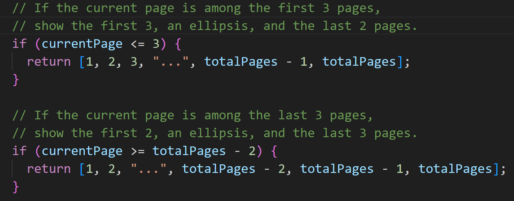
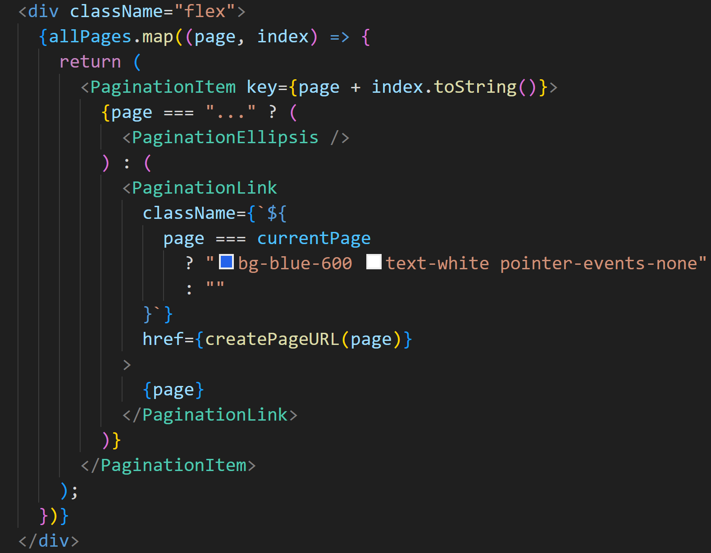
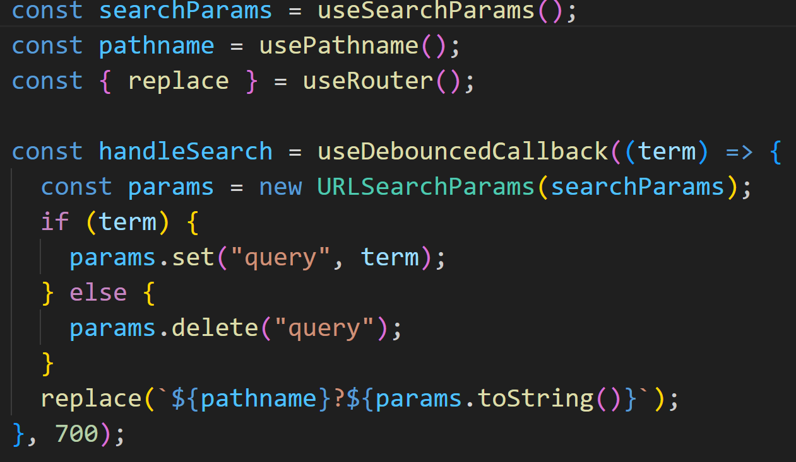
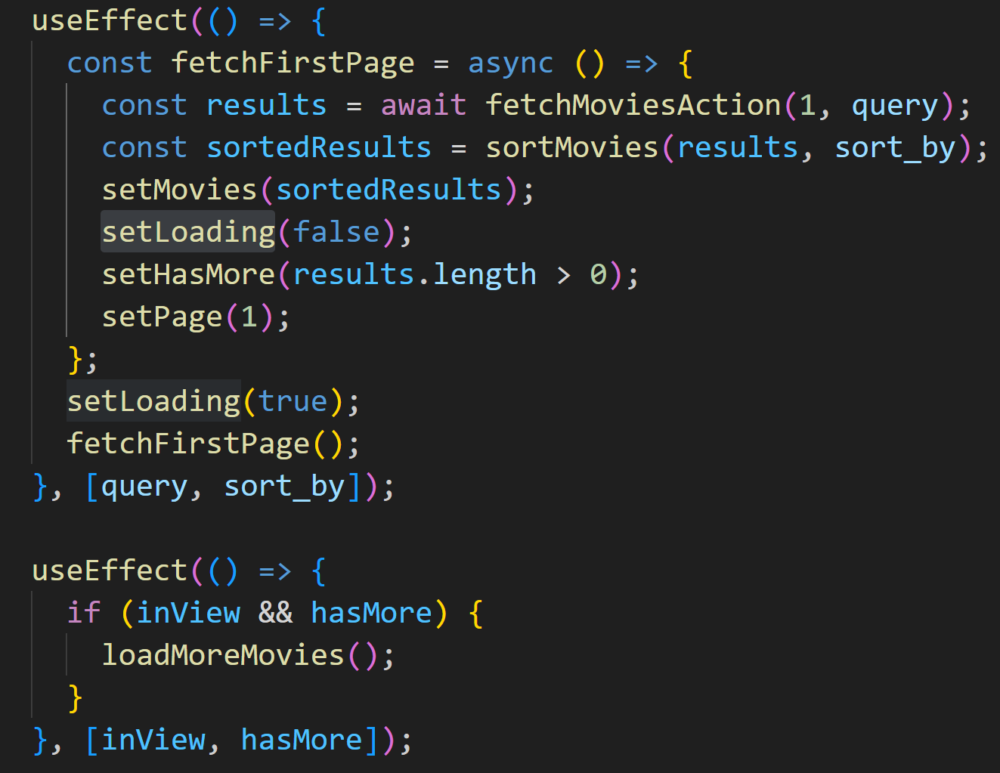
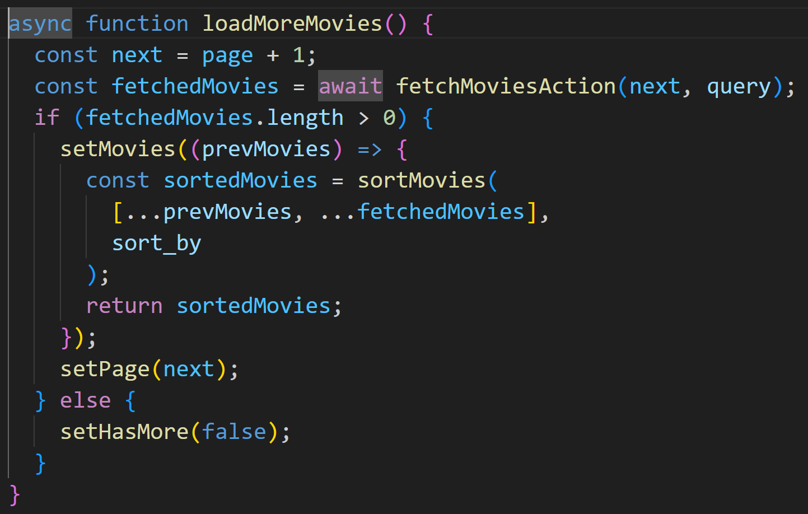
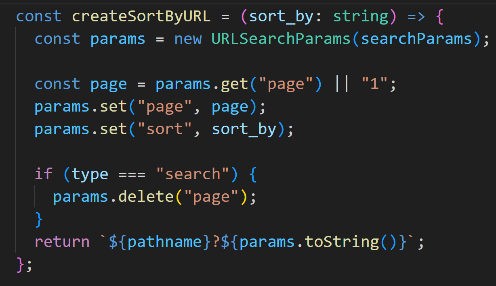
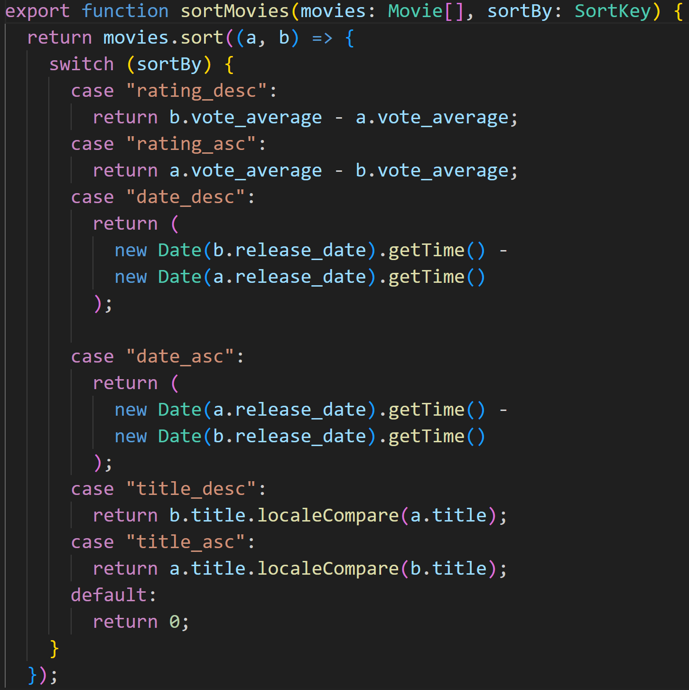

### 使用者 & 待看清單

使用 `onAuthStateChanged` 監聽使用者的登入狀態的變化，並根據使用者的 email，從資料庫取得使用者的待看清單，搭配 React Context 使不同 Component 能夠取得 `user`及`favoriteMovies`。

### Pagination

`generatePagination` 這個 function 根據 `currentPage` 決定回傳的陣列。

根據回傳陣列產生對應 page 的 link。

### Search

利用 URL 查詢參數來更新搜尋結果，並使用 use-debounce 防止過多觸發。

### Infinite Scroll

使用 react-intersection-observer 監測 Spinner 是否在畫面中，搭配 state 及 effect 更新頁數、fetch 下一頁資料，再和之前的結果合併起來。

### Sort

top-rated page 根據 URL 查詢參數決定 TMDB API 回傳的排序方式，而 search page 及 watch-list 使用 JavaScript 進行排序。

