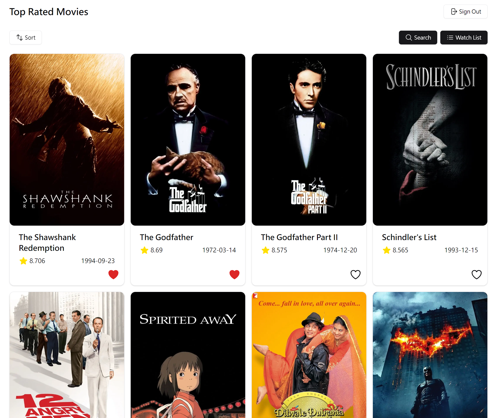
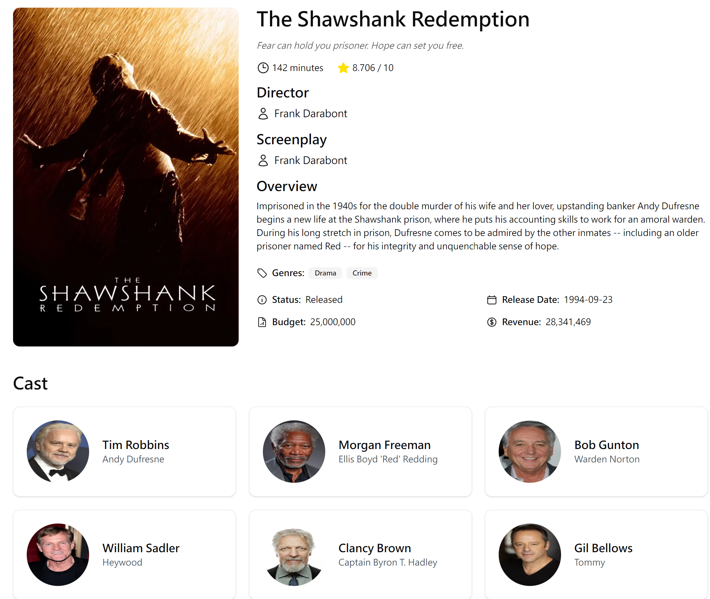

# Movies To Watch

### 功能簡介

- 查看最高評分電影，可依評分、上映日期及標題排序。
- 搜尋電影標題，以無限滾動呈現多頁搜尋結果。
- 點擊電影能看到導演、劇情簡介、演員等詳細資訊。
- 將電影加入待看清單，並在清單查看已收藏的電影，以及隨機選擇一部電影 (登入才能使用待看清單功能)

### 功能預覽

#### top-rated page:

瀏覽最高評分且評價數超過 1000 的電影，以 Pagination 呈現多頁資料。

#### details:

顯示電影的詳細資料

#### search page:

根據使用者輸入顯示搜尋結果，以 Infinite Scroll 呈現多頁資料。

#### watch-list

查看已收藏的電影，點擊 Choose One button 可以隨機選擇一部電影。

### Demo

[https://www.youtube.com/watch?v=syeUWmYPXbs&t=1s](https://www.youtube.com/watch?v=syeUWmYPXbs&t=1s)

### Tech Stack

TypeScript, Next.js, TMDB API, Tailwind CSS, shadcn/ui, Firebase Authentication, Cloud Firestore
